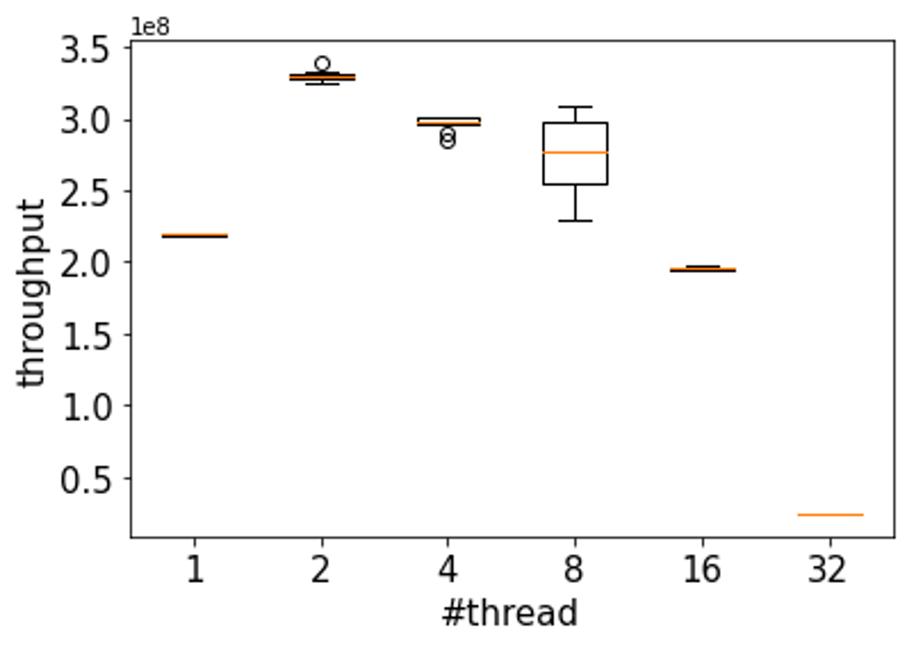

# Project2 - Wait-free Atomic Snapshot

The purpose of project2 is make the Wait-free Atomic Snapshot algorithm.

## Table of contents 
[0. How to build](#0-how-to-build)   
[1. Workload](#1-workload)  
[2. Performance test & analysis](#2-performance-test--analysis)  
[3. Unit tests](#3-unit-tests)

## 0. How to build

First, do the CMake configuration by using the command as follows:

```bash
cmake -S . -B build -DCMAKE_BUILD_TYPE=Release
```

And then, execute the command below to build the project.

```bash
cmake --build build
```

If all is done, you can see `run` and `wfa_test` executables in the root directory of this project. `run` is the performance checker (see the section 1 and 2). `wfa_test` is unit testing program (see the section 3).

```
project2
|-- build
|-- CMakeLists.txt
|-- include
|-- run
|-- src
|-- test
`-- wfa_test
```

You can execute `run` program according to the format below.

```bash
./run <the number of workers>
```

## 1. Workload

`run` program creates a set of number of threads and sends a signal to each thread when all threads are initialized to perform tasks simultaneously.
Each thread has a integer value, and that values are stored in the Wait-free Atomic Snapshot structure (`WFASnapshot` class instance) that is in the global scope.
For a minute, each thread generates a random number and update `WFASnapshot` with that value.
After a minute, the main thread collects the number of updates that all of threads made. In the section 2, I'll report the updating performance according to the number of threads.

## 2. Performance test & analysis

The machine information on which the performance test was conducted is as follows.

- OS: macOS Monterey (Version 12.5.1)
- CPU: Apple M1 Pro (10 core)
- Memory: 16GB
- g++ 11.1.0

Program was executed 10 times for each thread count configuration.
The following is a boxplot showing the performance test results.



The performance improved when the thread number was 1 to 2.
However, performance decreases at four or more thread counts, and performance decreases significantly when the number of threads is more than 10, the number of cores in the system.

I think it is because the more threads there are, the more likely stall is to occur.
In `Scan` operation, when at least one thread's snapshot is different between old and new copy, algorithm retry the operation.
Up to the two workers, the benefit of simultaneous execution is greater, but more than that, the penalty of the stall is greater.
In addition, in more than 10 thread situations, performance is significantly dropped because more than 10 tasks cannot be conducted at the same time due to the system core limitation.

## 3. Unit tests

To check whether my Wait-free Atomic Snapshot class works right,
I built some test cases. In the following subsections, I'll describe each test case.

### 3-1. StampedSnap/Initialize
This test case will check whether initialization of `StampedSnap` is right.

### 3-2. WFASnapshot/Initialize
This test case will check whether initialization of `WFASnapshot` is right.

### 3-3. WFASnapshot/SingleThread
This test case will check whether the two operations (Scan and Update) of `WFASnapshot` are right in the single thread situration (SRSW).

### 3-4. WFASnapshot/MultiThread
This test case will check whether the two operations (Scan and Update) of `WFASnapshot` are right in the multi thread situration (MRSW).
