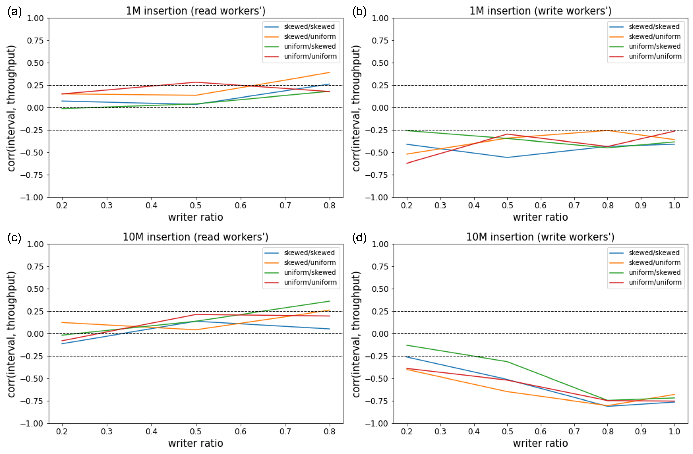

# Project3 - Optimize Open BwTree

## Introduction
In this project, I am going to optimize the Open BwTree data structure.
Open BwTree is an unofficial implementation of BwTree, suggested in the paper "The Bw-Tree: A B-tree for New Hardware Platforms, J. Levandoski *et. al* (2013)"
Using BwTree, we can do structure modification operations (a.k.a. SMO) without using latch (mutex).

I will try to improve the Garbage Collector that frees the memories of deleted nodes.
The Epoch Manager in Open BwTree executes garbage collection at fixed time intervals (50 milliseconds).
However, it was confirmed through several experiments that garbage collection interval (hereafter referred to as gc interval) had a significant effect on throughput.
Hence, I would like to introduce a adaptive the gc interval controller that adjusts the gc interval according to the system situation.

## Experiment

To check correlation between gc interval and write or read throughputs, I did some experiments.
All executions are performed in the environment described below.

- OS: Ubuntu Server 20.04 LTS
- CPU: Intel(R) Core(TM) i9-10940X CPU (3.30GHz)
  - hyperthreading enabled (14 cores, 28 threads)
- RAM: DDR4 128GB
- g++ 9.4.0

In order to reduce the deviation according to the state of the computing node and randomness, the result was obtained by performing 10 times for each setting.

▲ Figure 1) 

In Figure 1, writing throughput has negative correlation with gc interval.