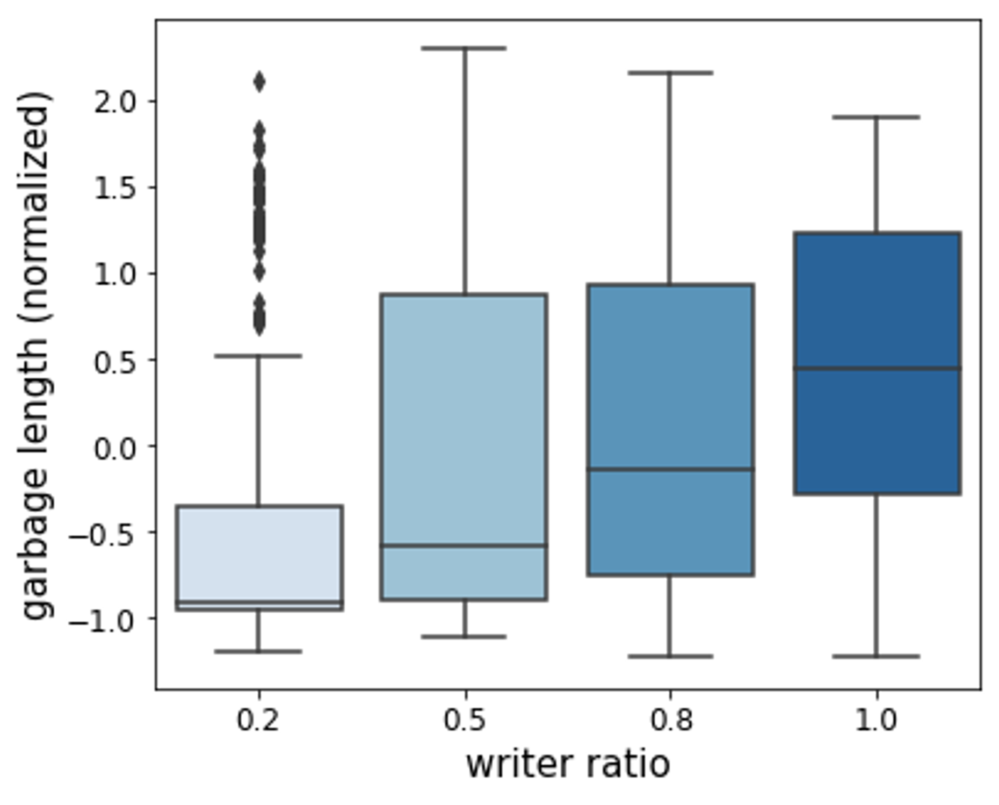

# Project3 - Optimize Open BwTree

## Introduction
In this project, I am going to optimize the Open BwTree data structure.
Open BwTree is an unofficial implementation of BwTree, suggested in the paper "The Bw-Tree: A B-tree for New Hardware Platforms, J. Levandoski *et. al* (2013)"
Using BwTree, we can do structure modification operations (a.k.a. SMO) without using latch (mutex).

I will try to improve the Garbage Collector that frees the memories of deleted nodes.
The Epoch Manager in Open BwTree executes garbage collection at fixed time intervals (50 milliseconds).
However, it was confirmed through several experiments that garbage collection interval (hereafter referred to as gc interval) had a significant effect on throughput.
Hence, I would like to introduce a adaptive the gc interval controller that adjusts the gc interval according to the system situation.

## Experiment

To check correlation between gc interval and write or read throughputs, I did some experiments.
All executions are performed in the environment described below.

- OS: Ubuntu Server 20.04 LTS
- CPU: Intel(R) Core(TM) i9-10940X CPU (3.30GHz)
  - hyperthreading enabled (14 cores, 28 threads)
- RAM: DDR4 128GB
- g++ 9.4.0

The correlation between gc interval and throughput was investigated in various situations.
There are three major variables: writer ratio and insertion/find key distributions.
Writer ratio is the ratio of threads that only insert among several worker threads.
If x% of workers only insert, (100-x)% of workers only find some key.
In skewed workload, keys are sampled from Gaussian distribution that mean is 0 and standard deviation is (0.01 * N), where N is insertion size (1M or 10M).
In order to reduce the deviation according to the state of the computing node and randomness, the results were obtained by performing 10 times for each setting.

▲ Figure 1) Pearson correlation coefficient between gc interval and throughput according to writer ratio. "skewed/uniform" means insertion key are skewed distributed and finding key are uniformly distributed.

In Figure 1, it can be seen that writing throughput has a negative correlation with the gc interval.
On the other hand, reading throughput generally has a positive correlation.
In addition, writing workers tend to be more sensitive to gc interval than reading workers.
In addition, there is also a tendency for the correlation to increase as the ratio of writing threads increases or the amount of input data.

Through these results, it was possible to think of a strategy to control the gc interval by detecting the writer ratio.
There will be some methods to implement this strategy.
I will devise various implementations in the following section.

## Detecting writer ratio

To implement my method, the logic to detect writer ratio is needed.
In the following subsections, I'll describe some ideas.

### Explicit writer ratio variable

If I use a single variable that stores writer ratio, it is possible to detect the ratio of writer against reader.
Explicit writer ratio value can be defined as below.

> ratio = (num of write) / (num of write + num of read)

There is no way to manage two variables atomically, so we need to use approximation.
Let ratio(t) denotes the writer ratio at time stamp t and v is 0 if currently operation is read, otherwise 1. We can define ratio with previous ratio value as follows.

> ratio(t) = ratio(t - 1) + [v - ratio(t - 1)] / t

If I use a fixed update step rather than 1/t, I don't need to manage the value of t. Fixed update step version is as follows.

> ratio(t) = ratio(t - 1) + [v - ratio(t - 1)] ⨉ a, where a ∈ [0, 1].

However, there can be critical bottleneck came from single variable.
If many threads approach ratio variable at the same time, there is a risk of performance degradation due to the cache validation storm problem.

### Indirect method

The problem with the direct method is that a number of threads approach single variable.
Therefore, if I use any value that correlates with the writer ratio among the information available to the garbage collector, it will be able to achieve the goal indirectly.

The garbage collector cleans the garbage nodes that depend on the current epoch every specific cycle.
And write operation may create garbage nodes.
If writer ratio is high, the length of garbage list will be high.
Hence, the writer ratio can be approximated by the number of garbage nodes in the garbage collector.
Since that value is accessed only from the epoch manager thread, there is no problem that may exist in a direct method.

Figure2) Boxplot of garbage length according to writer ratio.

In Figure2, there is a correlation between garbage length and writer ratio.
The Pearson correlation coefficient between them is about 0.34.
In addition, the Pearson correlation coefficients with write throughput and read throughput are 0.35 and -0.35, respectively.
Therefore, it seems that I can use it to achieve my goal.

## GC interval controlling

In Figure 1, the distribution of keys does not seem to have a significant effect between the gc interval and throughput.
Therefore, I will create a policy that controls the gc interval using only the garbage length.

If there is no writer thread, we don't need collect garbage frequently.
If the number of garbage nodes increases, write throughput decreases.
Therefore, in this situation, it is necessary to reduce the gc interval to collect garbage frequently.
Based on these facts, I suggest a method of adjusting the gc interval by estimating the distribution of garbage length.
A brief description of the controller algorithm is described below.

1. Get garbage length for every epoch.
2. If the garbage length of current epoch is larger than upper confidence bound, reduce gc interval by half.
3. If the garbage length of current epoch is lower than lower confidence bound, add positive constant to gc interval.
4. Update garbage length distribution (assume that the distribution is Gaussian).
5. Clip the gc interval so that it is within a specific range.

According to the above algorithm, when the number of writers increases, it will be possible to quickly respond and increase write throughput.
Since the reader is relatively less sensitive to the gc interval, I believe that the performance of the entire system can be improved by linearly increasing the gc interval.
